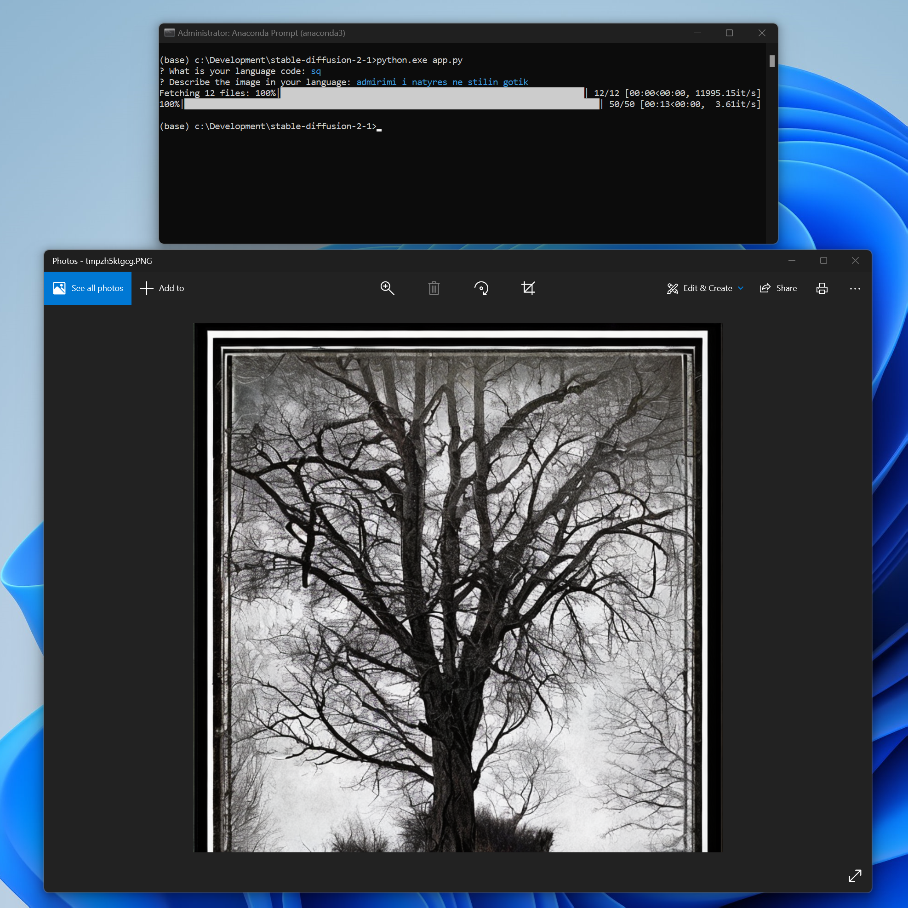

# Introduction
The `app.py` script makes use of Google Translate to generate images using stable diffusion 2.1 in all languages supported by Google's translation service.

## Motivation
My wife wanted to describe a picture in the Albanian language.

## Getting Started
Let's go

## Requirements
`python >= 3.7`

## Install Dependencies
``
pip install --upgrade git+https://github.com/huggingface/diffusers.git transformers accelerate scipy
``

``
pip install -r requirements.txt
``

## Demo
 

### Tips
- In case you receive an error such as `AssertionError: torch not compiled with Cuda enabled`; Install PyTorch-Cuda through [conda](https://www.anaconda.com/products/distribution)
- Use the Anaconda Prompt to run the python script

### Credit
This project depends on the great work done by the following projects & their authors.
- [Stable Difusion 2.1](https://huggingface.co/stabilityai/stable-diffusion-2-1)
- [py-googletrans](https://github.com/ssut/py-googletrans)
- [PyInquirer](https://github.com/kazhala/InquirerPy)
- [slugify](https://github.com/slugify/slugify)